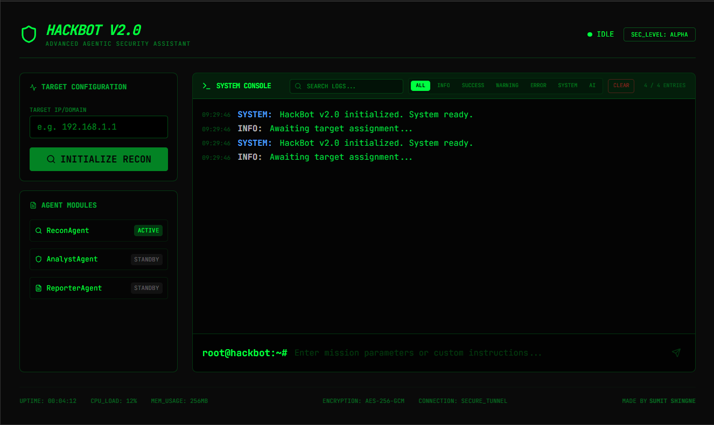
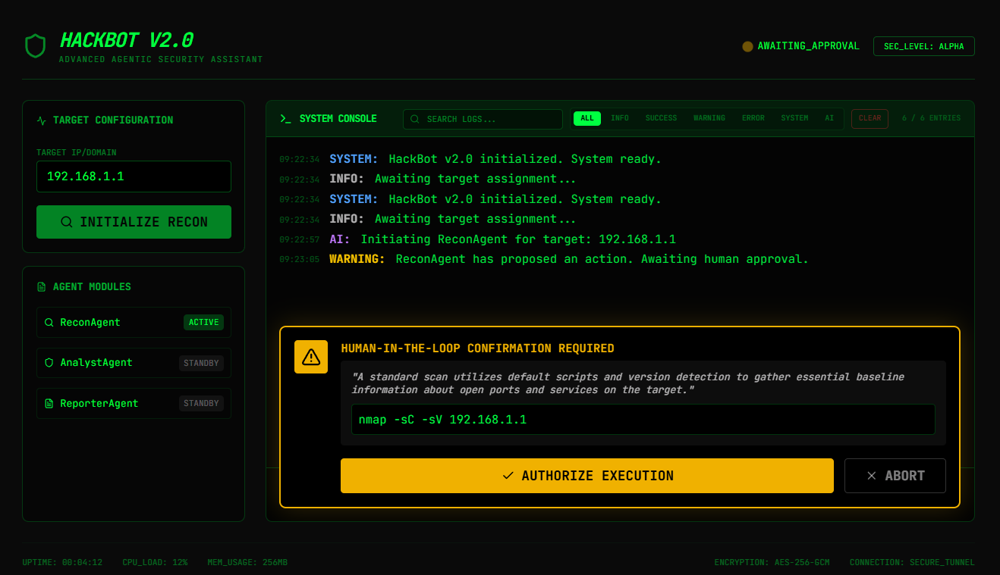
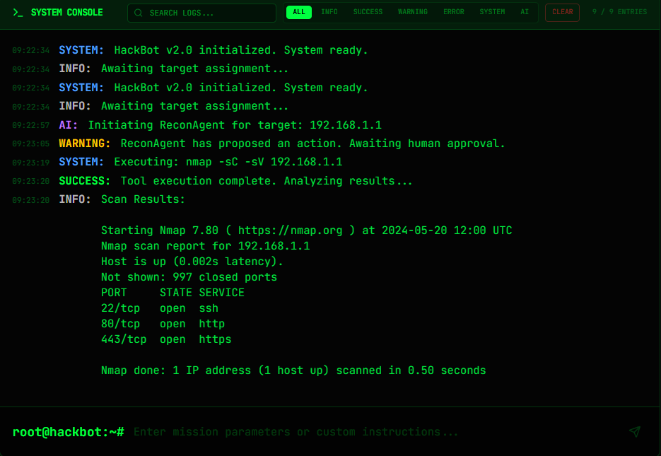

  

# HackBot v2.0 - AI-Driven Security Assistant

HackBot v2.0 is an advanced, interactive AI-driven security assistant designed for automated reconnaissance, vulnerability analysis, and interactive reporting. It combines the power of Large Language Models (LLMs) with traditional security tools to provide a streamlined, "agentic" security auditing experience.

## Core Features

- **Agentic Reconnaissance**: Uses a `ReconAgent` (powered by Gemini 3.1 Pro) to analyze targets and suggest optimal reconnaissance strategies.
- **Human-in-the-Loop (HITL)**: No security tools or scripts are executed without explicit manual approval from the user. Every proposed action includes a reasoning explanation.
- **Interactive Terminal UI**: A high-fidelity, hacker-style terminal interface for real-time log streaming, filtering, and searching.
- **Modular Architecture**: Separates agent logic, tool execution, and the user interface for scalability.
- **Mock Tool Integration**: Includes a simulated Nmap wrapper to demonstrate the workflow without requiring local installation of security tools.

## How to Use

1. **Set Target**: Enter a target IP address or domain (e.g., `192.168.1.1` or `example.com`) in the "Target Configuration" panel.
2. **Initialize Recon**: Click the **INITIALIZE RECON** button. The ReconAgent will analyze the target and propose a scan command.
3. **Review & Approve**:
   - The agent will display its reasoning and the proposed command (e.g., `nmap -sV -p- 192.168.1.1`).
   - Click **AUTHORIZE EXECUTION** to run the tool or **ABORT** to cancel.
4. **Analyze Logs**:
   - View execution logs in the terminal.
   - Use the **Filter** buttons (INFO, SUCCESS, AI, etc.) to narrow down logs.
   - Use the **Search** bar to find specific entries.
5. **Custom Instructions**: Use the terminal input at the bottom to provide specific mission parameters or custom instructions to the agent.

## Screenshots

### 1. Main Dashboard

### 2. Human-in-the-Loop Confirmation

### 3. Scan Results Analysis

## Technical Stack

- **Frontend**: React 19, Tailwind CSS 4, Lucide Icons, Motion (Framer Motion).
- **Backend**: Express.js (Node.js).
- **AI**: Google Gemini API (@google/genai).
- **Styling**: Custom "Matrix-style" theme with JetBrains Mono typography.

## Security Warning

This tool is intended for **authorized security testing and educational purposes only**. Always ensure you have explicit permission before scanning or testing any target.

---
**Made by Sumit Shingne**
[Instagram](https://www.instagram.com/sumit.shingne_?igsh=MTN3eTNsNDJ3YXhvYw==)
